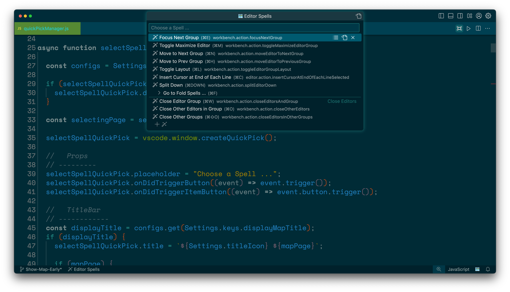
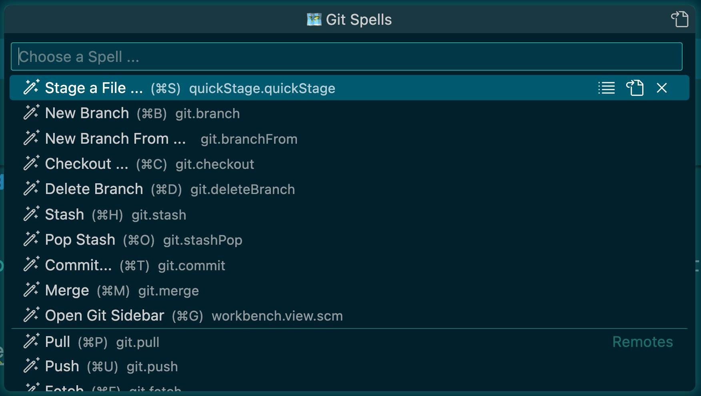
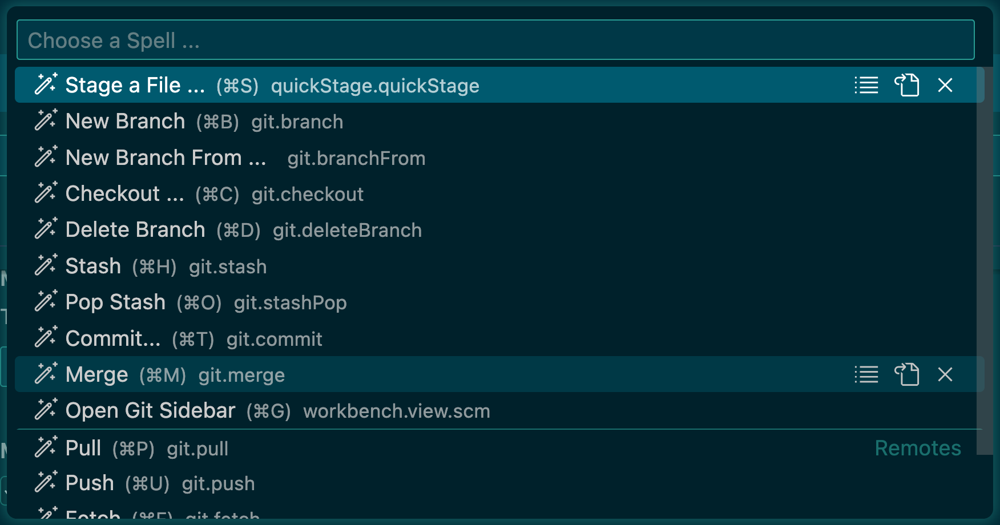
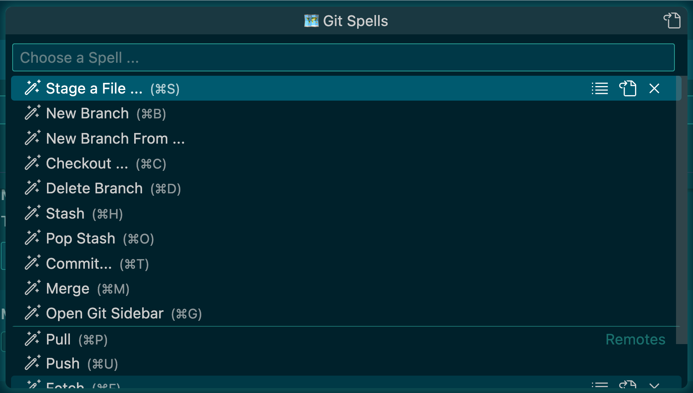

# The Marauder's Map

Do you ever get stuck wondering what key to press after you hit (⌘K)?

... me too!


The Marauder's Map is your magical guide that shows where all your favorite keyboard shortcuts are!

Keep your most cherished Spells and Charms on Pages in your very own Marauder's Map! 

Afterall, the best Witch or Wizard is an organized one!

Give each Page a memorable name, and save it to a unique shortcut, so you can open it quickly! Each Page can hold an unlimited number of Spells, each one with a unique shortcut to cast it when you need it.

But don't worry, should you forget how to perform your favorite wizardings,
the Marauder's Map will be there to **show you the way!**


## Using the Marauder's Map

The Marauder's Map is an extension that displays what keyboard shortcuts are available after pressing the first key of a chord: **(⌘K ⌘S)**

This is a similar concept to Vim's WhichKey, except this extension *does not require a leader key*.

At the most basic level, the Marauder's Map works like this:
- Press the assigned keyboard shortcut to open a "group" of commands
- Press the assigned keyboard shortcut for the desired command
- That's it
- It's really that simple

The cool part about The Marauder's Map is it will display a pop up menu to show what keyboard shortcuts are available in a group!



Each command in a "group" can be used by pressing the associated keybinding, or by selecting it on the Map and pressing **(Enter)**

The Marauder's Map comes with some example Pages and Spells to get started, from there it is infinitely customizable!


## Configurable Settings

There is a Delay between pressing a keybinding to open a Page of the Map and the Map actually being shown.

The Map only serves as a reminder of what shortcuts are available, and it is perfectly acceptable to use the Map in such a way that it is never even shown.

When a Page is active, pressing **(Space)** will display the Map immediately, regardless of the standard delay time.

----
### mapDelay:

The time delay before the map is shown

- Set the default delay time for all Pages in the Settings UI with `"MaraudersMap.defaultMapDelay"`

- Set a custom delay time for a specific Page by passing `"mapDelay"` in the args of the Page's Keybinding in `keybindings.json`
```
{
    "key": "cmd+e",
    "command": "MaraudersMap.iSolemnlySwearThatIAmUpToNoGood",
    "when": "!maraudersMapIsActive",
    "args": {
        "mapPage": "Editor",
        "mapDelay": 3000 <= custom mapDelay
    }
},
```
- The value is (ms): `3000` = 3 Seconds

- setting mapDelay to `0` will open a Page without a delay

- A Page will always use the custom `mapDelay` value over the default value

----
### showMap:

Another way of using the Map is for the Map to **NEVER** be shown automatically

This means the Map will **NOT** be shown unless **(Space)** is pressed after a Page is activated

- Set showMap for all Pages in the Settings UI with `maraudersMap.defaultShowMap`

- Set a custom showMap for a specific Page by passing `"showMap"` in the args of the Page's Keybinding in `keybindings.json`
```
{
    "key": "cmd+e",
    "command": "MaraudersMap.iSolemnlySwearThatIAmUpToNoGood",
    "when": "!maraudersMapIsActive",
    "args": {
        "mapPage": "Editor",
        "showMap": false <= custom showMap
    }
},
```
- A Page will always use the custom `showMap` value over the default value

----
### The following settings change the appearance of Map:

### displayMapTitle:
`"maraudersMap.displayMapTitle": false` will hide the title-bar of the Map, this makes the Map look more like a native UI
component
##### With Title:
 
##### Without Title:


### displayCommandId:
`"maraudersMap.displayCommandId": false` will hide the command id slug displayed with each Spell
 ##### With Command Id:
 
 ##### Without Command Id:


----
### These settings change the icons used in the Map
- Can be set to any string value
- [VS Code Theme Icons](https://code.visualstudio.com/api/references/icons-in-labels) can be used by placing the icon name inside `$( ... )`

### SpellIcon
`"maraudersMap.spellIcon"`

The prefix displayed for each Spell on a Page. 

The default is `$(wand)`. 

### PageIcon
`"maraudersMap.pageIcon"`

The prefix displayed for each Page on the Map.

The default is `$(book)`.

### SubpageIcon
`"maraudersMap.subpageIcon"`

The prefix displayed for all nested Pages on a Page.

The default is `$(chevron-right)`.

## Setting up
-   Open the Map's Main Menu with **(⌥M)** \ **(alt+M)**

-   Add a Page to the map by selecting the `+` icon 

-   Enter a name for the Page

-   Choose a keybinding that will open this Page

-   Add a Spell to the Page by selecting the `+` icon

-   Select the desired command from the list

-   Choose a keybinding that will run this Spell

-   Provide a custom label for the Spell

## Key Commands

- **(⌥M)** Mac \ **(alt+M)** PC => Opens the Main Menu of the Maruaders Map
- **(Space)** => Show Map immediately if a Page is active
- **(Escape)** => Close the Map if a Page is active
- **(⌘Left)** Mac \ **(Ctrl+Left)** PC => Go Back to the Previous Page

## Keybindings

When setting a keybinding for a Page or Spell, the keycodes must be typed as they appear in `keybindings.json`,
separated by `+` with no spaces.

- Example: `ctrl+alt+y`

- Common Keycodes: `cmd`, `ctrl`, `alt`, `shift`, `escape`, `enter`, `backspace`, `space`, `left`, `right`, `up`, `down`

The keybinding for a Spell may be left blank, this will add the Spell to the Page, but the Spell will only be useable by selecting it and pressing `Enter` once the Map has opened

## Separators

To keep a Page organized, Try adding separators!

- Select the `+` icon
- Select `+ Separator`
- Provide an optional label for the separator
- Choose where the separator will go

Separators are great for organization, and quick navigation using the default keyboard shortcut:

- **(⌘↓)** `"QuickInput.nextSeparator"`


## example keybindings:

```
// Page
{
    "key": "cmd+e",
    "command": "MaraudersMap.iSolemnlySwearThatIAmUpToNoGood",
    "when": "!maraudersMapIsActive",
    "args": {
        "mapPage": "Editor",
        "mapDelay": 300    // optional arg for per-page mapDelay
    }
},

// nested Page
{
  "key": "cmd+f",
  "command": "maraudersMap.mischiefManaged",
  "when": "maraudersMap.Editor_Spells",
  "args": {
    "command": "maraudersMap.iSolemnlySwearThatIAmUpToNoGood",
    "args": {
      "mapPage": "Fold Spells"
    }
  }
},

// Spell
{
  "key": "cmd+,",
  "command": "MaraudersMap.mischiefManaged",
  "when" : "MaraudersMap.Editor",
  "args": {
      "label": "Split Editor Down"
      "command": "editor.splitDown"
  }
},

// separator
{
  "command": "separator",
  "when" : "MaraudersMap.Editor",
  "args": {
      "label": "Close Editors"
  }
},

```

## Troubleshooting

### Cannot change keybingings in Keyboard Shortcuts UI

This extension basically uses a "wrapper" function; therefore, there will be a plethora of shortcuts in `keybindings.json` that all point to the same two commands.

Because of this, reassigning keybindings using the native "Keyboard Shortcuts" interface is not possible and keybindings must be changed in `keybindings.json`

There is an "Edit" button on each Spell that will open the associated keybinding in `keybindings.json`

----

### Keybinding for a Spell is not immediately available when opening a Page

Very seldom, a keybinding will not work immediately after activating a Page, but once the Map is shown the keybinding will work.

This is most likely due to a conflicting global keybinding.

This issue can be fixed by adding

`"when": "!maraudersMapIsActive"`

to the conflicting keybinding. Doing this *should* prevent VS Code from selecting the conflicting keybinding while a Page is activated.


## Thanks!

This extension does not pretend to fix everything about keybindings
in VS Code, but it does provide a new feature that I believe is **REALLY** powerful!

Please reach out if you have any suggestions or requests

I hope you find using this extension as entertaining as I found creating it!

##### Go make some magic happen

### _You're a Wizard Harry ..._

